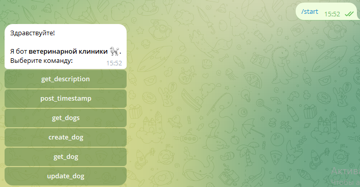
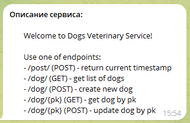
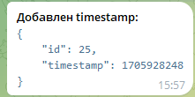
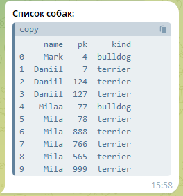
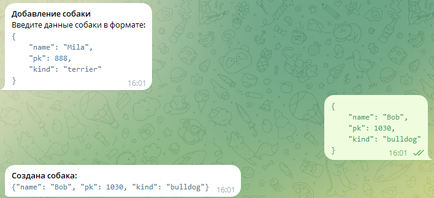
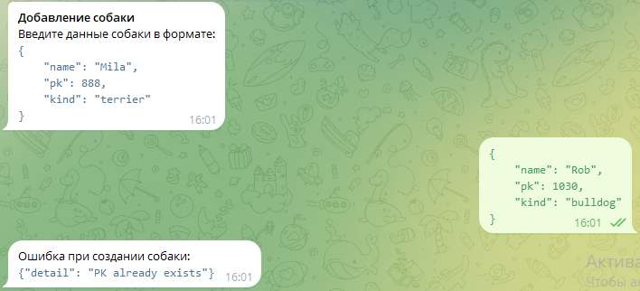
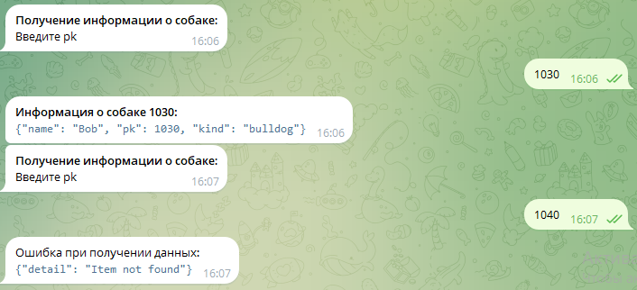
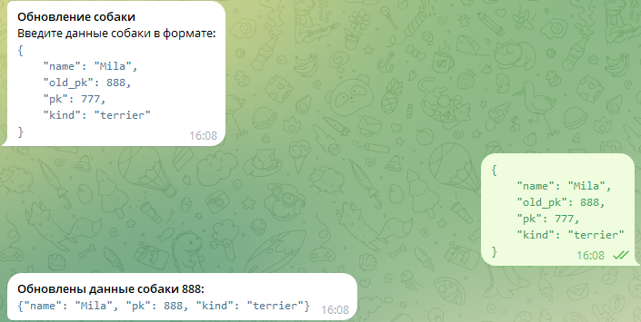
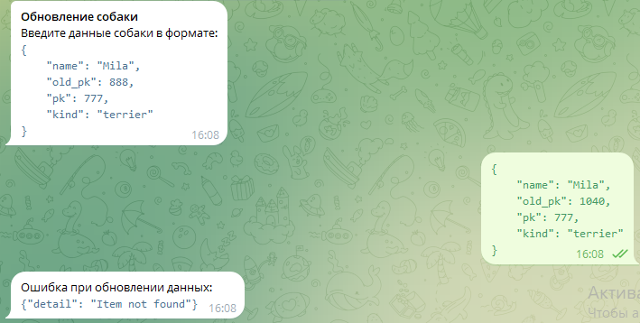

# Инструменты разработки (Мазепа Юлия)

- [API HeadHunter. Получение вакансий](\hw-1-head_hunter\hh.ipynb)

    Анализ вакансий ML и DS специалистов, полученных с сайта headhunter

- [FastAPI. Сервис ветеринарной клиники](main.py)

    API для ветеринарной клиники, реализованное на FastAPI + SQLAlchemy.

    Описание методов API:
    - `/post (POST)` - вспомогательный метод, фиксирующий временную метку запроса;
    - `/dog (GET)` - получение списка собак;
    - `/dog (POST)` - создание новой собаки;
    - `/dog/{pk} (GET)` - получение собаки по ключу;
    - `/dog/{pk} (POST)` - обновление информации о собаке по ключу;

- [Телеграм-бот. Сервис ветеринарной клиники](telegram-bot/)

    

    Бот доступен по адресу: https://t.me/dog_clinic_service_bot

    Доступны следующие команды:

    - [**/start**](#start)
    - [**/get_description**](#get_description)
    - [**/post_timestamp**](#post_timestamp)
    - [**/get_dogs**](#get_dogs)
    - [**/create_dog**](#create_dog)
    - [**/get_dog**](#get_dog)
    - [**/update_dog**](#update_dog)

    ### start

    Приветствие от бота, кнопки с выбором других команд

    

    ### get_description

    Описание сервиса на fastapi

    

    ### post_timestamp

    Создание timestamp в базе и возвращение результата

    

    ### get_dogs

    Получение списка всех собак

    

    ### create_dog

    Создание новой собаки

    

    

    ### get_dog

    Получение информации о собаке по pk

    

    ### update_dog

    Обновление информации о собаке по pk

    

    
