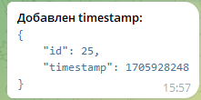
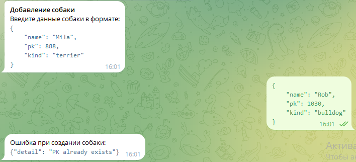
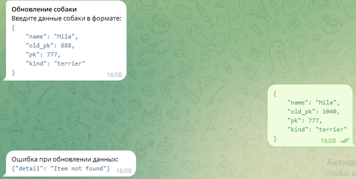

## Телеграм-бот

Бот доступен по адресу: https://t.me/dog_clinic_service_bot

Доступны следующие команды:

- [**/start**](#start)
- [**/get_description**](#get_description)
- [**/post_timestamp**](#post_timestamp)
- [**/get_dogs**](#get_dogs)
- [**/create_dog**](#create_dog)
- [**/get_dog**](#get_dog)
- [**/update_dog**](#update_dog)

### start

Приветствие от бота, кнопки с выбором других команд

### get_description

Описание сервиса на fastapi

### post_timestamp

Создание timestamp в базе и возвращение результата

### get_dogs

Получение списка всех собак

### create_dog

Создание новой собаки

### get_dog

Получение информации о собаке по pk

### update_dog

Обновление информации о собаке по pk

